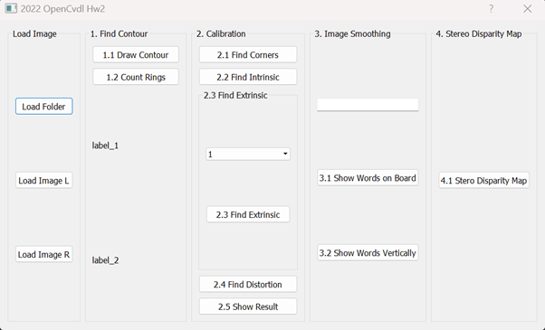
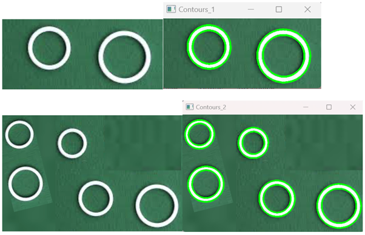
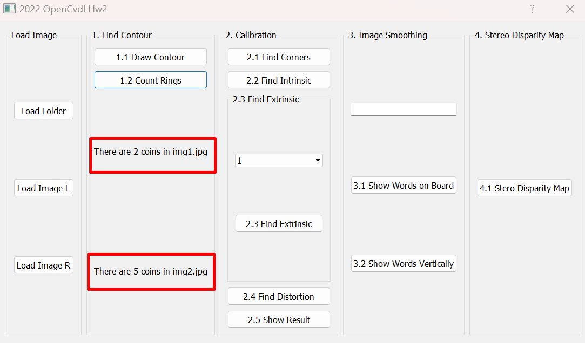
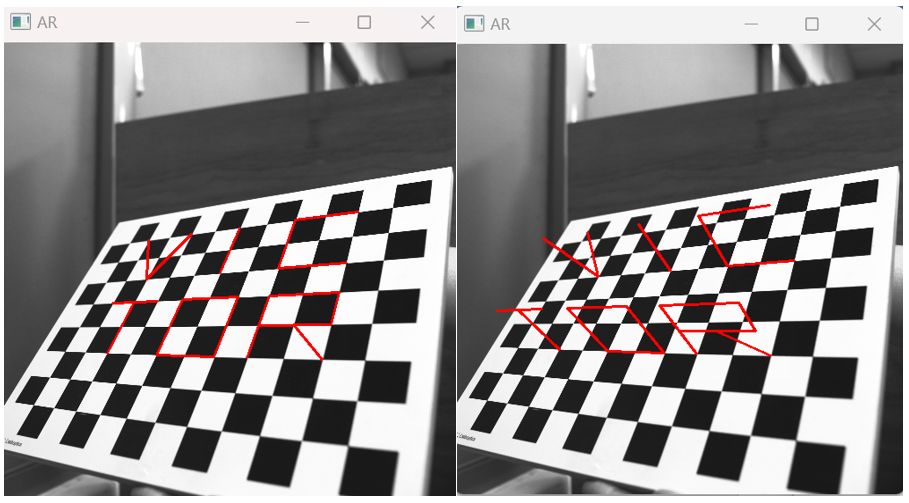

# OpenCvDl Project
Introduction to Image Processing, Computer Vision and Deep Learning.

## Windows
### Run
```
$ python main.py
```

## Features
This project includes four main features:
- Image Procesing
- Camera Calibration
- Augmented Reality
- Stereo Disparity Map

### Home Page


### Image Procesing
#### Draw Contour:
Using OpenCV functions to find the contours of rings in two images.



#### Count Rings: 
Using OpenCV functions to find how many rings in two images.



#### Find Corners: 
Find and draw the corners on the chessboard for each image.


#### Augmented Reality : 
Find and draw the corners on the chessboard for each image.


